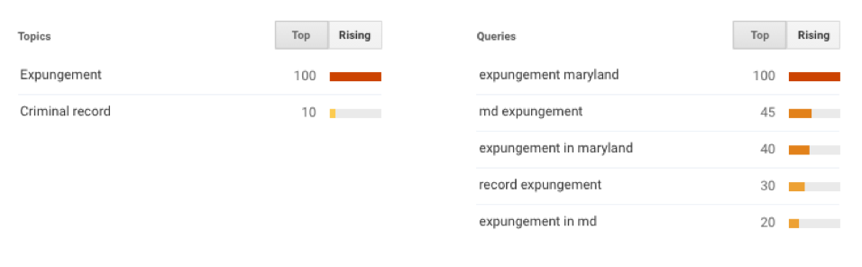

## Introduction

It is estimated that 70 million Americans have a criminal record.[^1]
Having a record creates harms, called collateral consequences, after a
person completes their contact with the criminal justice system. These
consequences hobble an individual’s ability to find work, housing, or
government services. For many, expungement is a possible legal remedy to
erase a criminal record. However, the expungement process is hard to
understand and not accessible to average citizens attempting to handle
their own filing. Further, there are not enough legal service providers
to meet demand to help everyone who qualifies. Attempting to bridge
these gaps, numerous groups and individuals are leveraging technology.
This report assesses the experience organizations had developing
expungement technology and provides recommendations to improve the
proliferation and impact of these tools.

Having an adult criminal record does not necessarily mean that one was
found guilty. For example, individuals may have a criminal record if
they were arrested, but not charged; charged, but not prosecuted; and
prosecuted, but never found guilty.

Even if someone was never found guilty, a criminal record in a federal,
state, or private database can prevent a person from obtaining
employment, government services, and education. For example, 87 percent
of employers conduct background checks on potential employees, and over
60 percent of individuals are left unemployed within a year of release
from prison.[^2] For those lucky enough to find work, their earning
potential is significantly reduced. The Pew Trusts found that a criminal
record reduces an individual’s annual earnings by 40 percent.[^3]
Nationally, criminal records have been estimated to cost the U.S.
economy up to \$65 billion each year, due to increased unemployment and
decreased wages.[^4]

Regarding higher education access, a component to breaking cycles of
poverty and criminality, one report found that 66 percent of
universities collect criminal record information in the admissions
process.[^5] This occurs around the country while there is no proven
link between a student having a criminal record and an increased risk to
campus safety.[^6] If one gets accepted to university with a criminal
record, an individual may also be denied federal student aid, including
Pell Grants.[^7]

These consequences disproportionately plague minority communities. One
recent study found that 49 percent of African-American men are arrested
by age 23.[^8] This is compared to the population at large, of whom 33
percent are arrested at least once by 23.[^9] Further, having a criminal
record is twice as likely to punish black job-seekers as it is white
ones.[^10]

For many, expungement and sealing are potential remedies to the
consequences caused by having a criminal record. Depending on the state,
these terms mean different things. Broadly speaking, expungement
obliterates the record and sealing hides the record from public view
(though it may remain accessible by law enforcement or by court order).
This process, however, is not do-it-yourself friendly. Obtaining one’s
record, filling out the right documents, filing, and presenting in court
all add a layer of complexity and difficulty for pro se petitioners.

For many, legal-aid providers help navigate the expungement process, but
indigent legal services are chronically unable to meet demand. There is
also private legal help, but it is often cost prohibitive and excludes
those that are most disadvantaged.

To overcome gaps in access to expungement services, lawyers, advocates,
and technologists are creating online tools, or “expungement apps,” to
make the expungement process easier to understand and to increase access
to legal assistance. Looking at six projects from five
jurisdictions,[^11] this report explores the process of designing and
building these tools, creating a real world community around the tool,
and evaluates the effectiveness of these tools. The report concludes
with seven recommendations to improve this work and its impact.

## The types of expungement tools

To frame the discussion, this section introduces the types of
expungement tools surveyed in this report and the purpose behind them.

Expungement apps are typically client- or attorney-facing, with some
additional specifications beyond that. Broadly speaking, there are two
styles of expungement app, those that determine eligibility through a
series of questions, and those that automate eligibility determination
and populating forms. The first style asks a series of binary questions
to help a user determine if a record is eligible for expungement. Once
determined, some projects then create a referral for the user to a local
legal aid provider, others just provide the determination and nothing
more. The second type takes a case number and extracts the relevant
information from a public records database to determine if a person’s
record is expungeable. In the case of the projects reviewed for this
report, they also auto-populate court documents to be filed in court.
Below are the six unique projects addressed in this report; the first
four represent the apps that ask questions, the last two are the
automated variety:

-   **Expunge.io**[^12] was launched in January 2014 by Smart Chicago, a
    non-profit civic technology organization.[^13] This public-facing
    responsive web-app was conceived at a summer program, co-run with
    Mikva Challenge, for youth in the Chicago area. While learning about
    technology, the youth participants broke into subject matter groups
    that included a juvenile justice section. Introduced to the idea of
    juvenile expungement, the youth felt that an app was the best way to
    explain this system to their peers. In partnership with the juvenile
    expungement desk at Cook County Legal Aid, Expunge.io provides
    referral assistance for individuals with a juvenile record in
    Cook County. The tool only addresses juvenile expungement.

-   **ExpungeMaryland**[^14] is a web-based tool created in 2014 by
    Advocates for Children and Youth (ACY) in Baltimore, Maryland, a
    child policy advocacy organization.[^15] In addition to an
    assessment of an individual’s eligibility for expungement, the app
    also provides referrals to pro bono legal groups and non-legal
    service providers helpful to those with criminal justice
    system contact. The app makes expungement determinations for youth
    seeking sealing, youth that were charged as adults, adults seeking
    expungement, and individuals that could receive vacatur[^16] for
    certain types of solicitation and prostitution charges under state
    and federal law. At the user’s request, those determinations are
    sent to local legal aid partners.

-   **My Clean Jacket**[^17] is an Android, iOS, and web-app created by
    the Justice and Accountability Center of Louisiana (JAC), an
    organization that helps individuals in the post-conviction process.
    An organization of two with a cohort of volunteers, JAC started to
    build the app in 2013 as a way to improve their reach across
    the state. It also became an educational tool for attorneys less
    familiar with the expungement statute. The app creates referrals to
    JAC itself or to local attorneys that have paid a donation to be
    named as a referral organization.

-   **Clean Slate D.C.**[^18] was born out of a hackathon held by
    Rebuilding Reentry in late 2014. Rebuilding Reentry is a component
    of Mission Launch, an organization that helps those reentering
    society learn entrepreneurial skills. Built with volunteers from
    Code for D.C., the tool handles adult records and is
    currently attorney-facing. At the time of writing, the tool was
    in beta.

-   **The Expungement Generator** is a tool built by Community Legal
    Services in Philadelphia, Pennsylvania. Launched in 2011, the tool
    searches the court’s public records database for a person’s file(s),
    then processes the files’ information to generate a near-ready,
    editable filing document. According to the app’s creator, the tool
    cuts document drafting time down from one hour to ten minutes. The
    tool is used by attorneys and law students in a clinic format and is
    not public-facing.

-   **MDExpungement**[^19] is a public-facing, web-tool built by Matthew
    Stubenberg, an attorney in Baltimore, Maryland. The beta launched in
    January 2015. Similar to the Expungement Generator, the project
    incorporated Maryland’s state criminal record database so that a
    user inputs a case number and the app makes a determination of
    whether or not the case is expungeable. If the case is expungeable,
    then the app auto-populates a document that can be filed with
    a court.

### The purpose behind an expungement app

While all of these projects are similar in that they improve expungement
understanding and access, each organization had a different purpose
behind their work.

Sonia Marizano, a project coordinator at Smart Chicago, explains that
Expunge.io developed as an intermediary between those that needed a
juvenile record expunged and the attorneys that could help. As an
intermediary, they wanted to get as many people as possible to existing
legal services through their portal.[^20] Since Expunge.io does not make
a legal determination and, instead, refers juveniles to legal help, the
tool evolved to have fewer questions to shorten the path to connect with
an attorney.

ExpungeMaryland was founded with a similar ethos and intent as
Expunge.io. However, instead of being built for the individual with a
record, it was built for professionals (e.g., social workers,
librarians, and parole officers) who regularly came into contact with
people with records, but lacked the legal background necessary to help
with the expungement process. The tool now, which is public-facing, also
has traffic from individual’s seeking to expunge their own records.

Clean Slate D.C., MDExpungement, and the Expungement Generator were
attempts to improve attorney workflow. Clean Slate D.C. accomplishes
this by making the expungement statute accessible for attorneys that
otherwise might not be familiar with the law. MDExpungement and the
Expungement Generator diminished the redundancy that it takes to
research and fill out expungements, thus saving attorneys’ time.

## Designing & building expungement tools

The design of any technology tool involves a mix of hypothesis,
validation, and iteration. This section explores the preexisting
requirements needed for these tools, the design steps organizations
used, and the cost associated with developing these tools.

### Requirements of an expungement tool

Based on the models discussed in this report, there are a couple of
necessary factors that need to exist before deciding to develop a tool.
These requirements include that the target population has access to the
Internet and that there is a controlling statute. For those looking to
replicate the Expungement Generator model, an accessible and reliable
criminal records database is also required.

All six of the projects reviewed for this report built web-based
expungement tools, meaning that the Internet is required to access and
use the tool. In building their web-based tools for expungement, all
projects also assumed that their targeted end-user has the ability to
get online. However, the age, income, and digital nativeness of a
desired end-user will potentially affect if an online tool is the right
choice. Surveying the app’s intended audience from the beginning will
help determine this issue.

For organizations looking to replicate any of these projects, it is
important that they consider – not only whether a web-based tool is the
right path – but also the local statutes and hearing processes.

Some expungement laws are easier to build a tool for than others.
Specifically, jurisdictions that apply an objective factor test
regarding what type of record is expungeable are ideal. MDExpungement’s
Stubenberg points out that statutes allowing for significant judicial
discretion, “good person” factor tests, or a requirement to call
character witnesses or victims to testify create a subjective decision-making process that is not suited for the structured decision-making
that these tools use. An assessment of the statute by an attorney should
be sufficient to make a determination.

Projects like the Expungement Generator or MDExpungement require access
to a criminal record database. Although Pennsylvania and Maryland both
have reliable, public databases, the majority of states do not. In
jurisdictions without a database, this model will be difficult to
implement. While it is likely possible to make a public records request
for adult criminal record information to create a database independently
of the courts, this time consuming approach may create more work than it
offsets.

### Designing for the potential user

When developing a new tool, getting input from potential clients and
partners is important. MDExpungement’s Stubenberg did not survey users
about their needs or habits in the early stages of his project. He
regretted the choice, saying that taking time at the beginning to
understand user needs and design “would have saved a lot of time down
the road.”

Two approaches at gathering feedback are Smart Chicago’s CUT Group and
ExpungeMaryland’s efforts to make legal jargon accessible.

#### **Smart Chicago’s Civic User Testing**

While most organizations tested their ideas with community members and
lawyers, many were limited by capacity, experience, and funding to
thoroughly test their projects. However, Smart Chicago was uniquely
positioned to undertake user testing because of their Civic User Testing
(CUT) Group, which pays a community of Cook County residents to test
civic websites and apps in a structured way.[^21]

Smart Chicago wrote about two focus groups they ran and how it informed
an update for Expunge.io. From the outset, Smart Chicago wanted answers
to the following questions:

-   Is Expunge.io easy to use? Do users like the website? Are there any
    problems/issues using the website?

-   What stands out on Expunge.io? What do users remember? Do users have
    a good understanding of the expungement process after visiting the
    website?

-   Do they want to share information with others?

-   How can Expunge.io be improved?

Through their test group, they found that users were hung up on the fact
that the expungement filing process cost money and that one had to be 18
or older to file. The app previously included this information, but
users felt it needed to be more prominent. Testers felt that if they
were sharing the tool with peers, they would not want this information
to be “hidden,” which at the time they felt it was. Another
recommendation through this process was to include social media buttons
on landing pages to increase sharing.

*An Expunge.io landing page with no social media buttons. Courtesy of
Expunge.io.*

#### **ExpungeMaryland & Legal Jargon**

The ExpungeMaryland project came up against a challenge that faces many
public-facing legal tech projects: how can legal jargon be made
accessible to a non-legal audience? One goal of the ExpungeMaryland
project was to have the site text written at a seventh grade reading
level. However, words like “expungement” and “nolle prosequi” stood in
the way of this goal. Further, if a user read from their RAP sheet to
answer questions, then legal terms would be their point of reference. To
split the difference, ExpungeMaryland created “mouseover” or hover text
for the legalistic and Latin terms that could not be replaced with
simple English.[^22] This approach allowed the project to use the legal
terms that people would see on their RAP sheets while increasing
understanding of those that did not have their RAP sheet handy.
Colleagues and attorneys tested language on the site, but ACY did not
have the capacity to undertake a community focus group at the time.

    
*An example of hover text. Courtesy of ExpungeMaryland.org.*

### The cost of making an expungement tool

By and large, organizations built their tools with the help of
volunteers; however, those same organizations found that relying on
volunteers only got them so far. Clean Slate D.C. reached out to a local
Code for America Brigade for help. A University of Maryland Law School
student coded ExpungeMaryland. The legal aid attorneys that wanted to
use a tool for their own practice and advocacy created the Expungement
Generator and MDExpungement.

My Clean Jacket, which was coded by a professor and students at Loyola
University New Orleans, estimated that donated developer and attorney
time to build the app totaled \$30,000. Michael Hollander of the
Expungement Generator estimated that he spent 200 hours over the past
four years on the project, which includes training others to use the
tool. At a developer rate of \$150 an hour, this would also put this
project at \$30,000 total.

While these organizations got their projects started with the help of
volunteers, some articulate a need for funding to improve usability,
functionality, and access. My Clean Jacket said that they had reached
their limit on what they could accomplish with free labor, and that if
they were going to include a form builder or any other feature they
would need a grant of \$35,000 to cover those development costs.
ExpungeMaryland and Clean Slate D.C. also mentioned the lack of funding
as one reason that their projects are slow to move forward.

Organizations said that the other costs to setting up and maintaining
their projects were low. Excluding maintenance, MDExpungement had the
most expensive yearly overhead at \$300 a year. Other projects were
spending less than \$50 a year, primarily on domain names and hosting.

## Building community around new technology & improving user adoption

Being an online tool underpins all of these projects; however, real
world organization and community outreach are important to project
success. As Adrienne Wheeler, the executive director at JAC, put it,
“It’s not about just building an app.” Merely building a tool and
putting it online does not mean that the intended audience will find it
or that people will use it. In this regard, more traditional coalition
building and search engine optimization improved people’s access to and
use of the tool.

### Building a real world community around a new tool

Organizations took different approaches to driving traffic to their
platforms, which included direct-to-consumer advertising, reaching out
to non-traditional partners, using data to better understand a
community’s need, and incorporating the tool into a third-party’s
workflow.

Community building is a strong aspect of Expunge.io. Marizano says that
the youth driven project took dozens of professionals and a half dozen
organizations from different fields to come together and build the
project. Through this effort, however, a community cropped up around the
tool, which helped create awareness and drive traffic.

On account of this input, Smart Chicago varied their approaches to drive
traffic to Expunge.io. First, they received a grant that allowed them to
put ads on city buses. Second, they put a kiosk at the Cook County Legal
Aid juvenile expungement helpdesk that lets people access the tool.
Third, they train youth volunteers to do “lunchroom take overs” in
Chicago public schools, which allows for peer-to-peer education about
expungement. Fourth, Smart Chicago, with their partners, has educational
events where they hand out cards that help draw people to the site.
Similarly, JAC sent postcards out to potential beneficiaries of My Clean
Jacket.

To build a broad community coalition, ExpungeMaryland and MDExpungement
undertook significant community outreach. Shortly after launch,
ExpungeMaryland reached out to community organizations, the faith
community, librarians, and elected officials to introduce the tool.
Elected officials found the tool particularly useful for their
constituent services. This increased the size and type of the community
supporting the tool, as well as increased the network of non-legal
referral organizations the tool could direct users to. Further, it
increased traffic to the site. ExpungeMaryland saw traffic grow monthly
for the first year after its launch.

To increase knowledge and information about expungement in Baltimore,
MDExpungement mapped where all of the individuals with expungeable
records are in the city. Beyond visualizing the 937,787 potential
expungements in a city of 620,000,[^23] this visualization better
informs providers where expungement clinics should be held. It also
provides an opportunity to reach out to individuals with records that
live near an upcoming clinic.

Further, MDExpungement became a part of the intake process at Maryland Volunteer Lawyers Service (MVLS), a non-profit legal service provider. When a new client comes in for legal assistance the client’s name is put in the app to see if he has an
expungeable criminal record. Wrapping this platform into MVLS’s intake
process is improving the tool’s impact. According to the app’s creator,
one in four MVLS clients has an expungeable criminal record.

### Helping potential users find tools online

For public-facing tools, being high on a Google result is one why to
improve connection to potential users. This is because fewer than five
percent of online searches go beyond the first page of results.[^24]
Expunge.io, ExpungeMaryland, and MDExpungement, spent time on making
their sites findable through search engines. This process, called search
engine optimization (SEO), started out with the selection of the name.
All three use “expunge” in some capacity, and the two Maryland projects
also included the state’s name. This is useful because it brands the
site in a way that reflects what people search for. For example, see the
Google Trend analysis of the word “expungement” search from a Maryland
IP address shown below.

    
*Courtesy of Google.com/trends.*

The column on the right represents the top five permutations of
“expungement” used by those searching in Maryland. The list makes clear
that when people are searching for expungement help, they are doing it
for Maryland specifically, thus why the literal branding of
ExpungeMaryland and MDExpungement has utility. If the name of the
website reflects what people are searching for, people are more likely
to find it. Through their SEO efforts, ExpungeMaryland and MDExpungement
are the third and fifth Google result, respectively, when searching for
“Expungement Maryland”.

Regarding online access, the CUT Group taught Expunge.io’s team that two
URLs they used,
[*http://www.expunge.io/adultrecord*](http://www.expunge.io/adultrecord)
and
[*http://www.expunge.io/adultorjuv*](http://www.expunge.io/adultorjuv),
were blocked by parental controls because of the word “adult”. By
changing the URL, this problem was overcome and parental controls no
longer kept users from finding the site. This was a unique problem for
their audience because many users were searching from school computers
with parental controls.

Bridging the worlds of SEO and real world community organizing, it is
also helpful to have popular Google results for “expungement” link to
the project’s website. To this end, ExpungeMaryland contacted the top
ten Google results for “expungement Maryland” and asked sites’ owners to
include ExpungeMaryland.org as a resource. This helped pull the then
nascent project off the back pages of Google results.

The last point on SEO is Google AdWords Grants. This is a grant through
Google.org for non-profits that provides funding for Google AdWords,
which will promote the site at the top of relevant Google searches. It
is simple to apply for, and it significantly helped boost
ExpungeMaryland’s place in Google results.

## Evaluating impact & improving longevity

While the ingenuity going into increasing access to expungement is
impressive, the results are mixed. This section looks to quantify the
impact these tools are having, understand the hurdles organizations had
after launch, and determine if these tools can offset their costs.

### The impact these tools are having

It is still hard to quantifiably evaluate these tools across
jurisdictions because some projects are using analytics and some are
not. Those that are collecting data are not necessarily collecting the
same data, making comparisons challenging.

This is the data that was made available for this report:

-   Expungement Generator: This project has the most thorough data on
    impact and outcome of any project in this report. The creator of the
    platform says that the tool has been used for nearly 10,000
    expungement filings as of fall 2015. Ninety-eight percent have been
    granted statewide. Philadelphia Lawyers for Social Equity also uses
    the tool to help “tougher clients” with more extensive
    criminal records. Their success rate of attaining expungements
    through the tool is 94 percent. In 2010, the year before the app was
    first used, the First Judicial District in Philadelphia saw 4,430
    expungements filed. The year after the app’s release, 2012, the
    court saw expungement filings jump to 8,125; in 2013, there
    were 6,003. The First Judicial District in Philadelphia said
    publicly that they believe that the Expungement Generator made a
    noticeable impact on the number of expungements being filed.[^25]

-   MDExpungement: While this project launched in January of 2015 as a
    beta test, it remained under the radar until October 2015. That
    being said, the project saw 1,000 unique petitions printed between
    January and October. Between October 2015 and February 2016, when
    the site was fully public, 6,400 unique petitions were printed. The
    project’s creator says that the tool is primarily being used at
    expungement clinics in Baltimore City and by attorneys that file
    numerous petitions.[^26] Since anyone can print these petitions, it
    is not currently possible to know how many have been filed
    or granted.  The project’s creator envisions a feedback loop with
    the court’s public website that updates as the state removes records
    from the database.

-   Expunge.io: This project made their click through rate available for
    this report. Of the users that came to the site’s homepage, 40
    percent clicked to see if they were eligible for expungement, but
    only twelve percent got through the disclaimer, which raised
    concerns that there are too many steps between start and finish.
    They are unable to track the number of filings that occur on account
    of the app.

-   ExpungeMaryland: While the tool has seen steady traffic, upwards of
    1,200 unique visitors a month, this has not translated to
    significant filings. Statewide the platform has led to 124 filings
    total, all but two are pending at the time of writing.

-   My Clean Jacket: Fully launched in January 2014, the platform has
    had 750 individual users across the country as of December 2015.
    Forty of those users have clicked through for a referral. They have
    not tracked actual filings, because filing has primarily happened
    through their attorney partners.

-   Clean Slate D.C.: No data available at the time of writing.

### Hurdles organizations experienced after the initial launch

After launch, projects experienced numerous challenges, including data collection regarding project referrals and
outcomes, understanding the number of people who could potentially
receive an expungement, and succession planning in the case of statutory
and organizational changes.

Expunge.io, which is collecting data through the site, struggles to
track who physically comes to the legal aid help desk because of the
app. A part of this issue is because two legal organizations staff the
help desk and they do not share information between themselves. The
project has not figured out how to accurately track case outcomes.

ExpungeMaryland, which includes a list of non-legal referral services
for end users, does not track click-through rates of those links.
Similarly, the referral organizations do not know if the referral is
coming from ExpungeMaryland or somewhere else. This makes it impossible
to know if users are using this information.[^27]

All of the projects surveyed want to see more traffic to help more
people expunge their criminal records. However, most projects do not
know how many potential expungements exist in their jurisdiction, which
means there is no baseline to judge if traffic is good or bad. For
example, the impact of 100 monthly referrals creates a different impact
in a jurisdiction that has 10,000 as compared to one million potential
expungeable records. As mentioned above, MDExpungement and the
Expungement Generator assessed the public records database to get a
sense of how many expungeable records there are in Baltimore and
Pennsylvania respectively. However, no other project knows what “good”
traffic would look like.

Another post-launch challenge that creators face is keeping the app
legally up to date as statutes change. Less than six months after
ExpungeMaryland launched, the state created juvenile expungement for the
first time. A year after that, the expungement law was reformed
significantly, which increased the type of cases that were expungeable.
However, at the time of writing this report, the project still reflected
the 2014 law. Since the launch of the project, the creator and developer
of ExpungeMaryland left the organization, and as current leadership
states, the project is not their “highest priority.” Still, the project
is live and people will find it high on Google results for expungement
in Maryland, which means that individuals may be told that they cannot
expunge their record when in fact they can. ACY says they struggle to
find a developer to update the project.

### Charging a fee to support the tool 

Only MDExpungement and My Clean Jacket experimented with a pay
structure. MDExpungement started with a \$10 user fee. Stubenberg says
this was to offset his costs to keep the project alive. After just five
expungements, he decided to make the tool free. There is no fee for
attorneys that use the tool to help clients.

My Clean Jacket, owned and operated by a non-profit, intends to be
financially self-sufficient. To this end, attorneys can donate money to
the project and become named referrals through the app. Currently, the
fee structure is \$400 for a six month listing and \$600 for a year-long
listing. Ten attorneys statewide have made the donation as of January
2016. In the next iteration of the project, Wheeler hopes to include a
form builder feature that will have a subscription model for attorneys,
while pro se litigants will be able to use it for free.

## Recommendations

Understanding the experiences of these six projects provides insight
into where this work has yet to go. Based on feedback from these
projects and independent analysis by SIMLab, we make seven
recommendations to improve the impact of expungement tools.

**1. Expand understanding of the greater expungement system.**

Either as referral tools or form generators, these tools are dependent
on larger legal and bureaucratic systems. To understand this system
better, projects should map the broader expungement ecosystem. In doing
so, jurisdictions can better understand all of a bureaucratic system’s
moving parts as they pertain to expungement, better visualize potential
roadblocks, and more effectively propagate solutions.

One potential roadblock affecting the impact and development of
expungement tools is access to accurate criminal records. States like
Maryland and Pennsylvania have reasonably accurate public record
databases for the use in these projects. However, similar databases
exist in a minority of states, and so other steps must be thought of to
overcome this disconnect. Having limited access to records increases the
time expungement takes and the chance that a user disengages with the
process.

Expunge.io provides a good example on how to overcome this roadblock.
When Expunge.io first launched, a client would be referred to the legal
aid help desk via the app, then the client would go to the police
department to request a copy of his RAP sheet, which then took two weeks
to arrive. Expunge.io and their partners went through great efforts to
gain access to the CLEAR police records system to look up RAP sheets at
the help desk. While a great step forward in streamlining this process,
it does not overcome getting records from outside Chicago.

**2. Quantify the need for expungement.**

A part of understanding the larger ecosystem is quantifying the number
of potentially expungeable records in a jurisdiction. Of the 70 million
Americans with a criminal record, only a fraction of them will be
eligible for expungement. Only MDExpungement and the Expungement
Generator took this step. Where this information is difficult to attain,
one potential way to get a ballpark figure is to understand case outcome
rates in a particular jurisdiction. For adult records, charges and case
outcomes should be public record. The total number of potentially
expungeable outcomes less the number of open cases would provide a rough
sense of the need. This step will be useful for non-profit organizations
to show the size and scope of the problem and convince funders that this
is a community-wide issue worth tackling and funding.

**3. Improve data collection and case tracking.**

Each project wanted to improve its data collection ability. Only one
project, Expungement Generator, tracks outcomes. To understand the
capacity of these tools, collecting outcomes of filings is critical.
Accomplishing this will look different depending on the jurisdiction and
the project’s partners. For jurisdictions that cannot automate their
data collection through a public records search, it would be valuable to
create a feedback loop with either end users or partner attorneys to
capture this data. This feedback loop would also create a check for the
bureaucracy to make sure that it is thoroughly and quickly executing
expungements after they are granted.

Data collection should also be deployed in regards to understanding
referral services. While ExpungeMaryland has a resource page for
non-legal services, there is no current way to capture the click-through
rate or to follow up with those service providers to understand how many
referrals come through the site. This coupled with qualitative user
feedback would improve the utility of these referrals and inform how to
better tailor the page for users.

Better data collection could also improve legislative advocacy. Both
ExpungeMaryland and My Clean Jacket have designs to use the site’s data
to inform the policy debate around expungement. While neither has
actualized this plan, the idea is to quantify which part of the statute
is most likely to preclude someone from expungement by tracking
click-through rates. By having this information, advocates can be better
informed about what parts of the expungement statute, if changed, would
provide the greatest impact. Taking this step is one way to increase a
tool’s impact in the greater expungement ecosystem as discussed in
recommendation one.

**4. Explore new ways to improve and increase automation.**

Judging by the numbers made available for this report, more workflow
automation correlates with more expungements filed. This is likely
because it improves the efficiency of creating appropriate documents by
cutting down on redundancy. Below are examples of different types of
automation or automation workarounds and ideas for where automation can
head.

One example of increasing automation is the Expungement Generator’s
recent iteration. Previously, when an attorney used the Generator they
searched the court records database manually, downloaded the relevant
documents, and then uploaded those documents to the Expungement
Generator. Now, the app automatically searches the court records
database at the attorney’s request, saving time.

Where automation was not possible, the developer of the Expungement
Generator created a visualization tool to compliment the attorney’s
work. A new law in Pennsylvania allows for sealing of certain second and
third degree misdemeanors. On account of this change, the Generator
now identifies sealable cases as well as expungeable ones. One
challenge in automating the search for sealable records is that the
court records database frequently does not mention the degree of the
charge. To overcome this, Hollander created the database visualization
shown below. The new search engine allows an attorney to enter a
criminal statute and see the historic application of the charge over the
last five years and whether a particular charge is potentially sealable
under the new law. The lines in red are not sealable, the ones in white
are.

Beyond this specific work, it is also worth exploring how automated the
entirety of the expungement process can become. Specifically, does a
person with a criminal record have to be involved at all? It is not out
of the realm of possibility to build an expungement bot that would
search a criminal record database, create the appropriate documents to
file for expungement, print every expungement the bot could find, and
then an attorney would file them with the appropriate court. This model
raises interesting questions around cost, whether or not this would
constitute representation of a client, what happens if there is an
error, and how to get an individual’s signature, if needed, for a
filing. The answers to these questions would be unique to the
jurisdiction and dispositive on whether or not this idea was worth
pursuing. In the alternative, an expungement bot could find a defined
class of people for a class action suit to expunge certain records in
bulk, like what is being done in Tennessee.[^28]

This hypothetical approach begs a larger question: why do statutes not
allow for automatic expungement for certain outcomes? There is
legislative movement to increase the type of outcomes that receive
automatic expungement. The bulk, automated filing approach could embrace
Smart Chicago’s “flood the box” philosophy to bring legislative
attention to the fact that people with outcomes found in their favor
still have to file for expungement.

**5. Build tools that compliment, not burden, providers.**

Based on the data collected for this report, the most impactful tools,
as measured by number of expungements filed, are those that compliment
legal providers (the Expungement Generator and MDExpungement). Both
projects dovetail into an existing expungement workflow and improve
attorney drafting time. In comparison, Clean Slate D.C. said that their
initial legal partner was over burdened with work before the creation of
the project. Depending on how the tool is used it could bring in more
clients, compounding the problem without improvements to attorney
workflow. In Louisiana, JAC found that creating the tool demonstrated their expungement expertise and had the unintended consequence of lawyers sending them potential expungement clients, which, at higher rates, could overload the organization.

Another dimension to this issue is project-organization fit.
Specifically, while ExpungeMaryland was developed by and for ACY, a
staff change made the tool no longer a priority. The current director of
the project stated that the project was not his focus. This leaves the
tool in purgatory; while it still remains high on search engine results,
its inaccuracy and lack of attention diminish its impact. Succession
planning and off-boarding should be considered when developing these
projects to improve longevity and impact.

**6. Tools should provide a path to relevant non-legal services.**

While these tools are focused on the issue of expungement, the referral
mechanism should include relevant non-expungement services. For those
with criminal records, housing, educational, vocational, substance
abuse, and family services are all potentially relevant to their needs.
ExpungeMaryland acknowledged the need for this approach, but does not
help the user find the appropriate service for their specific need.
Including triage questions around these related issues would embrace a
“wrap around” service approach, and provide users with a more holistic
set of services for their specific needs.

**7. Explore ways to impact non-government criminal record websites.**

The projects looked at in this report only handle expungement of
official records held by government agencies. “Mug shot” websites and
other non-governmental websites mean that a person’s criminal record can
live beyond an expungement. Even though Google changed its algorithm to
suppress “mug shot” websites,[^29] it can require thousands of dollars
to have mug shots and criminal records permanently taken off these
sites. Because of the use of off-shore servers, it will be hard to
regulate these websites. Expungement projects should explore ways to automate takedown notices, which could include working with police departments to use the Digital Millennium Copyright Act to have these photos taken down.[^30] This would recognize and
potentially impact broader issues affecting those with criminal records.

## Conclusion

Collectively, the projects discussed in this report have the potential
to increase attorney efficiency, improve individual access to justice,
and promote greater awareness to this underrepresented issue. There is,
however, room for experimentation and growth as these projects become
more common. Doing so will hone the scope and improve the potential of
this work.

## Appendix: Interviews

#### Clean Slate D.C.
- Briane Knight, attorney and developer, Washington D.C.
- Laurin Hodge, Mission Launch, Washington D.C.

#### Expunge.io
- Cathy Deng, DataMade, Chicago, Illinois.
- Chris Rudd, Stanford Design School, Palo Alto, California.
- Sonja Marziano, Smart Chicago Collaborative, Chicago, Illinois.

#### ExpungeMaryland
- Michelle Swift, Maryland Volunteers Lawyer Service, Baltimore, Maryland.
- Rais Akbar, Advocates for Children and Youth, Baltimore, Maryland.
- Sandy Brown, Mid-Shore Pro Bono Inc., Easton, Maryland.

#### Expungement Generator
- Michael Hollander, Community Legal Services, Philadelphia, Pennsylvania.

#### MDExpungement
- Matthew Stubenberg, Maryland Legal Apps LLC, Baltimore, Maryland.

#### My Clean Jacket
- Adrienne Wheeler, Justice and Accountability Center of Louisiana, New Orleans, Louisiana.
- Judson Mitchell, Loyal University New Orleans, New Orleans, Louisiana.

----  

### Footnotes

[^1]: Matthew Friedman, Just Facts: As Many Americans Have Criminal
    Records As College Diplomas, the Brennan Center for Justice, Nov.
    17, 2015. Available at
    https://www.brennancenter.org/blog/just-factsmany-americans-have-criminal-records-college-diplomas

[^2]: The Sentencing Project, Americans with Criminal Records. Available
    at http://www.sentencingproject.
    org/doc/publications/cc\_HiT\_CriminalRecords\_profile\_1.pdf

[^3]: The Pew Charitable Trusts, Collateral Costs: Incarceration’s
    Effect on Economic Mobility, 2010. Available at
    http://www.pewtrusts.org/\~/media/%20legacy/uploadedfiles/pcs\_assets/2010/
    collateralcosts1pdf.pdf?la=en

[^4]: John Schmitt and Kris Warner, Ex-offenders and the Labor Market,
    *Center for Economic and Policy Research*, Nov. 2010. Available at
    http://www.cepr.net/documents/publications/ex-offenders-2010-11.pdf

[^5]: Center for Community Alternatives, The Use of Criminal History
    Records in College Admissions Reconsidered, 2010. Available at
    http://www.communityalternatives.org/pdf/Reconsidered-criminal-hist-recs-in-college-admissions.pdf

[^6]: Ibid.

[^7]: Students with Criminal Convictions have limited eligibility for
    student aid, Department of Education, accessed March 25, 2016.
    Available at
    https://studentaid.ed.gov/sa/eligibility/criminal-convictions

[^8]: Robert Bram et al, Demographic Patterns of Cumulative Arrest
    Prevalence by Ages 18 and 23, Pediatrics, Jan. 6, 2014. Available at
    http://pediatrics.aappublications.org/content/129/1/21.full

[^9]: Ibid.

[^10]: Devah Pager, The Mark of a Criminal Record, *American Journal of
    Sociology*, March 2003. Available at
    http://scholar.harvard.edu/files/pager/files/pager\_ajs.pdf

[^11]: Information about each application was collected through phone
    interviews and email correspondence with individuals that helped
    build or administer these projects. This report would have been
    impossible but for the generous time and openness provided by the
    people creating these tools around the country. There is a list of
    interviews in the appendix.

[^12]: http://www.expunge.io.

[^13]: For a complete timeline of the Expunge.io project, visit
    http://www.smartchicagocollaborative.org/smart-chicago-expunge-io-and-ecosystem/

[^14]: http://www.expungemaryland.org

[^15]: The author of this report was the project principal on the
    ExpungeMaryland project; however, he is no longer a part of the
    project since leaving ACY.

[^16]: Vacatur is when a court vacates a legal proceeding. This is not
    expungement; however, the outcome is similar.

[^17]: http://www.jaclouisiana.org/?page\_id=54\#!lea---the-mobile-app/covz

[^18]: https://www.cleanslatedc.com/\#/

[^19]: http://www.mdexpungement.com/

[^20]: Smart Chicago calls this philosophy “flood the box”. The goal of
    this philosophy is to overwhelm the current process and force a
    reexamination of the underlying policy and system. According to
    Smart Chicago, this approach brought more people to the help desk,
    which increased the help desk’s funding. Further, on account of the
    increased demand for criminal record RAP sheets, the CLEAR system,
    the Chicago police’s records database, was integrated at the help
    desk to better streamline the expungement process.

[^21]: Smart Chicago wrote a book on the CUT Group model that can be
    accessed for free at http://www.cutgroupbook.org/. The participants
    for this testing group were not normal CUT participants, but youth
    involved with Mikva Challenge, a community partner in the Expunge.io
    project.

[^22]: Hover text is when a cursor floats over a word and a box with
    information appears. An example on ExpungeMaryland can be seen here:
    http://www.expungemaryland.org/b13

[^23]: This number encompasses criminal records created since 1992. It
    is unknown how many of these records belong to people that have
    passed away or left the Baltimore area.

[^24]: Advanced Web Ranking, Google Organic CTR Study, July 2014.
    Available at https://www.advancedweb
    ranking.com/google-ctr-study-2014.html

[^25]: Jason Tashea, Cleaning Records by the Thousands, *American Bar
    Association Journal*, September 1, 2015. Available at
    http://www.abajournal.com/magazine/article/meet\_our\_2015\_legal\_rebels/

[^26]: In Maryland, each expungeable case is petitioned individually.
     The law does not allow for a person to expunge multiple cases on
    their record in a single petition.

[^27]: A larger caveat about analytics generally is that they only track
    what is on the site, it cannot inform you of the gaps your site has
    or the frustration experienced by the user trying to access the
    tool.

[^28]: Amanda Haggard, Class Action Motion Could Expunge 350,000 Charges
    for 128,000 Nashville Residents, *Nashville Scene*, Sept. 16, 2015.
    Available at http://www.nashvillescene.com/pitw/archives/
    2015/09/16/class-action-motion-could-expunge-350000-charges-for-128000-nashville-residents

[^29]: David Segal, Mugged by a Mug Shot Online, the *New York Times*,
    Oct. 5, 2013. Available at
    http://www.nytimes.com/2013/10/06/business/mugged-by-a-mug-shot-online.html?pagewanted=all&\_r=2&

[^30]: Jason Tashea, Police Should Weaponize the DMCA, *Medium*, December 11, 2016. Available at https://medium.com/@jtashea/police-should-weaponize-the-dmca-bcdd672b0904#.p01x99fb2.